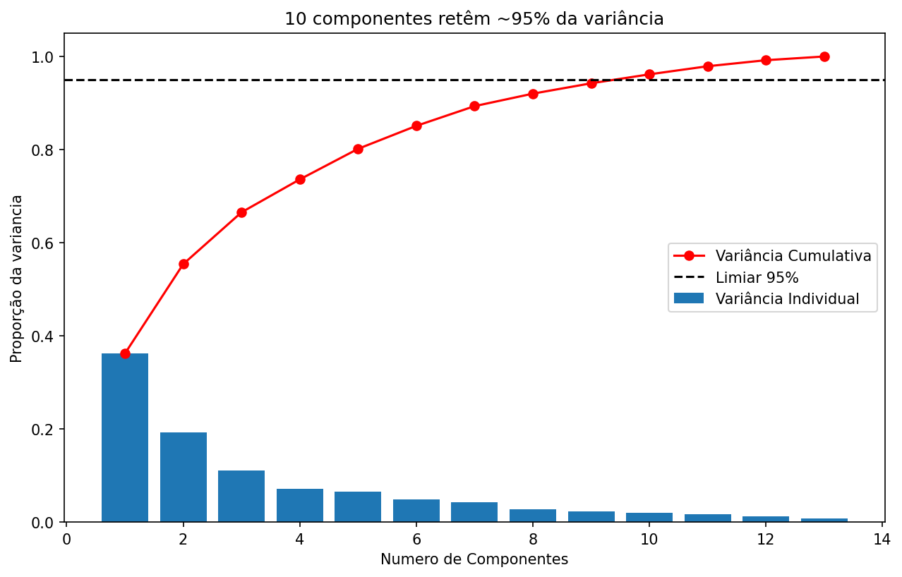
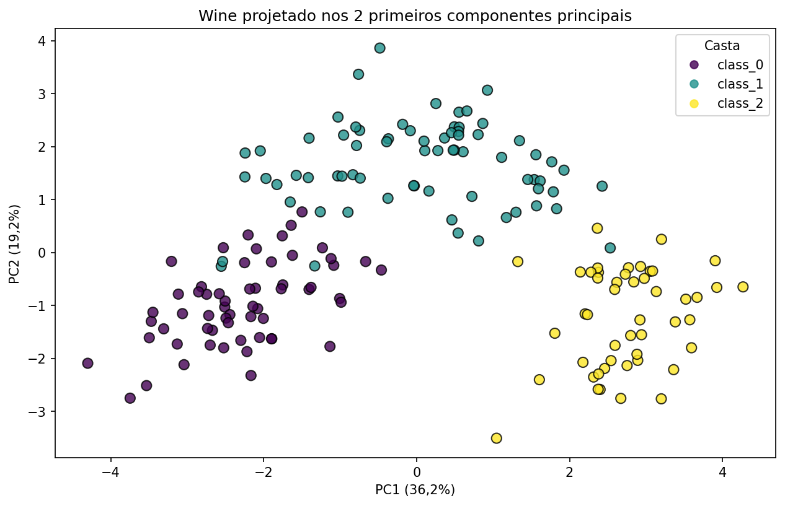

# MML from scratch

**🌐 Language:** [Português](README.md) · **English**

[](https://github.com/ReCroffi/mml-from-scratch/actions/workflows/tests.yml)

> From-scratch implementation (NumPy) of PCA and linear regression, applied to a real dataset —
> capping off the *Mathematics for Machine Learning* specialization (Imperial College / Coursera).

> ⚠️ **Work in progress.** PCA and linear regression (gradient descent + normal equation) are
> implemented, validated, and covered by automated tests (`pytest`). The analysis notebook and
> the SVD comparison are the next steps (see [Pipeline](#pipeline)).

## Goal

Implement PCA (and, next, linear regression) **by hand**, in pure NumPy — covariance matrix,
eigendecomposition, projection, and reconstruction — without calling `sklearn.decomposition.PCA`.
The point isn't dimensionality reduction (any library does that in one line); it's **understanding
the underlying math** and proving the implementation is correct by validating every result against
scikit-learn.

## Dataset

**Wine** (`sklearn.datasets.load_wine`): 178 samples, 13 numeric features, 3 wine classes
(~59 samples each — well balanced).

Chosen deliberately for the **disparate feature scales**, which make standardization
non-negotiable before PCA:

| feature   | standard deviation | variance (≈ σ²) |
|-----------|-------------------:|----------------:|
| `proline` |              ~315  |         ~99,000 |
| `magnesium` (2nd) |        ~14  |            ~200 |
| the rest  |          0.1 – 2.3 |             < 6 |

PCA chases **variance**, and variance depends on the unit of measurement. Without standardizing,
the first principal component ends up nearly collinear with the `proline` axis — not because it
explains the wine, but because its numbers (mg/L, in the thousands) are large. Standardizing
(`(X - μ) / σ`) removes that unfairness: every feature gets variance 1 and PCA compares them on
equal footing.

## Pipeline

| # | Step | Status |
|---|------|--------|
| 1 | Load + standardize by hand (`normalize`) | ✅ |
| 2 | PCA by hand: covariance → eigendecomposition → projection (`cov_matrix`, `eig`, `PCA`) | ✅ |
| 3 | Reconstruction (`reconstruct`) — inverse of the projection | ✅ |
| 4 | Validate against sklearn — automated tests in `tests/test_pca.py` (`normalize` centers · components match sklearn · `reconstruct` roundtrip) | ✅ |
| 5 | Linear regression from scratch: gradient descent (`gradient_descent`) — MSE gradient derived by hand | ✅ |
| 6 | Closed-form solution: normal equation (`normal_equation`) + proof that GD converges to it — tests in `tests/test_regression.py` (GD ≈ normal equation · analytical gradient ≈ numerical) | ✅ |
| 7 | Regression on the PCA *scores* — connects the two halves of the project (proven: MSE identical to regression on the features, by rotation invariance) | ✅ |
| 8 | SVD + comparison with the eigendecomposition (ill-conditioned case) | ⬜️ |

## Results

Cumulative explained variance (verified — matches `sklearn` to the 4th decimal):

| components | cumulative variance |
|------------|--------------------:|
| PC1        |              36.2 % |
| PC1 + PC2  |              55.4 % |
| PC1 + PC2 + PC3 |         66.5 % |
| ~10 of 13  |              ~96 % |

That is: reducing from 13 → 2 dimensions already preserves more than half of the variance —
enough for a 2D scatter colored by class.

### Explained variance per component



The bars are each component's variance; the red line, the cumulative total. The "elbow" is clear:
PC1 alone carries 36.2% and the first few concentrate almost everything. The curve crosses 95% at
the 10th component — you can go from 13 features to 10 components losing only 5% of the information.

### The cultivars on the PC1 × PC2 plane



Each point is a wine projected onto the first two components (≈ 55% of the variance). The three
cultivars separate into well-defined groups — and PCA **never saw the labels**: it only maximizes
variance. The classes emerge because the difference between cultivars *is* the largest source of
variation in the data.

## The math behind it

<!-- Renan: draft for you to adjust in your own voice. Make sure you can defend each point out
     loud — this is what comes up in interviews. -->

**Why diagonalize the covariance instead of staring at the raw data.** The covariance matrix is
symmetric and positive semidefinite (PSD). This isn't textbook trivia — those two properties are
what make PCA exist. Symmetry gives real eigenvalues and orthonormal eigenvectors (that's what
`np.linalg.eigh` hands me). PSD gives eigenvalues ≥ 0, and that *has* to hold: each eigenvalue is a
variance, and negative variance doesn't exist. A negative one would be a bug, not a discovery.

**What eigenvector and eigenvalue mean here.** Eigenvector is a direction; eigenvalue is how much
variance lives along it. The eigenvectors are the principal components, mutually orthogonal — new,
rotated axes pointed where the data spreads most. The sum of the eigenvalues is the trace of the
covariance, i.e. the total variance. PCA doesn't create or destroy variance. It just redistributes
it, from the axis that explains most to the one that explains least.

**Why `Xnᵀ @ Xn` is the covariance.** With the data already centered, each `(i,j)` entry of that
product sums the products of the deviations of features `i` and `j` over all samples — which is
literally the definition of covariance. Dividing by `N-1` turns the sum into a mean.

**Sign ambiguity.** An eigenvector is defined up to sign: both `v` and `-v` are valid. So my scores
match sklearn's in magnitude, sometimes with a flipped sign. Not a bug, a property — and the
validation test has to be robust to it (I compare `np.abs`, not the raw values).

**The MSE gradient, derived by hand.** This is where Calculus shows up. The loss is
`MSE = (1/n)·Σ(ŷ−y)²`, and to minimize it I need its derivative with respect to the weights. Chain
rule: the derivative of `r²` is `2r`, and the derivative of the residual `r = xᵀw − y` w.r.t. `w`
is `x` itself. Put them together and the gradient is `(2/n)·Xᵀ(Xw − y)`. I didn't take the formula
on faith — I checked it against the numerical gradient (finite differences), and it matched to the
last digit.

**Gradient descent vs. normal equation — when to use each.** Both reach the same `w` (I proved it
in a test). The difference is the path. The normal equation solves in one shot,
`w = (XᵀX)⁻¹Xᵀy`, but it inverts a matrix: ~`O(d³)` cost, and fragile when features are nearly
collinear (`XᵀX` becomes ill-conditioned). Gradient descent gets there step by step, inverts
nothing, and scales to sizes where inverting a matrix is out of the question. That's why the real
world — and all of deep learning — runs on gradients, not closed forms. The closed form here was
the answer key that proved my gradient was right.

**The bridge between the two halves.** Linear regression is invariant to rotation of the feature
space. PCA with all components is just a rotation (orthonormal basis, nothing lost — the roundtrip
proves it). So regressing `proline` on the 12 scores gives predictions and MSE identical to
regressing on the 12 original features. The weights change, because they live in a rotated basis;
what the model predicts doesn't. That was the "aha" that stitched PCA and regression into one
project.

## How to run

```bash
python -m venv venv
source venv/bin/activate
pip install -r requirements.txt
jupyter notebook notebooks/analysis.ipynb
```

To run the tests:

```bash
python -m pytest -v
```

The tests validate PCA against `sklearn` (`sklearn.decomposition.PCA`), check math
properties of their own (centering and reconstruction roundtrip), and cover the regression
(gradient descent converges to the normal equation, the analytical gradient matches the
numerical one via finite differences, and regression on the PCA *scores* reproduces the MSE of
regression on the features — rotation invariance).

## Structure

```
mml-from-scratch/
├── src/         # testable implementations (pca.py, regression.py)
├── notebooks/   # the narrative: EDA → PCA → regression → comparison
├── tests/       # validation against sklearn (test_pca.py, test_regression.py)
└── data/        # dataset (Wine ships with sklearn; folder reserved)
```

## What I learned

<!-- Renan: draft in your own voice to adjust. Everything here came from something I actually
     stumbled on. -->

- **A pure function beats a script with the data baked in.** My first PCA loaded the dataset inside
  the module. Felt handy — until testing time, when I realized I couldn't reuse the functions on any
  other input. Pulling the loading out and leaving the modules as pure functions is what made the
  project testable. `regression.py` came out clean on the first try.

- **A test with no `assert` tests nothing.** Obvious in hindsight, not before. My first test computed
  the check and threw the result away. The `assert` *is* the test; everything else is setup. I also
  learned that running through `pytest` (which discovers tests and sets up the path) is different from
  running the file as a script — and why only the first one works.

- **In a comparison test, one side is my code, the other is the reference.** I spent a while comparing
  sklearn against its own transpose before realizing my own result had been left out of the `assert`.
  A test that compares the reference to itself is theater.

- **`.copy()` in NumPy isn't optional.** In the numerical gradient, `w_plus = w` doesn't copy — it
  points at the same array, and touching `w_plus[i]` corrupts the original `w`. Classic silent bug.
  Now "reference or copy?" is the first question I ask when an array changes without my say-so.

- **Derive the gradient by hand and prove it with finite differences.** This gave me the most
  confidence: it's not "I trust the formula," it's "I proved it." Same idea as backprop, on a model
  that still fits in your head.

- **Details that looked like pedantry turned into understanding.** `ddof=1` explains the tiny
  difference from `StandardScaler`; standardizing (scale) isn't the same as centering (mean); and
  with standardized data the regression intercept comes out exactly equal to the target's mean —
  which I used as a sanity check on the bias term.

- **CI isn't decoration.** Putting the tests on GitHub Actions forced me to make sure
  `requirements.txt` is complete, because the runner starts from a bare environment. Missing a
  dependency? It goes red. (And I learned the hard way that pushing a workflow needs the `workflow`
  scope on the token.)
